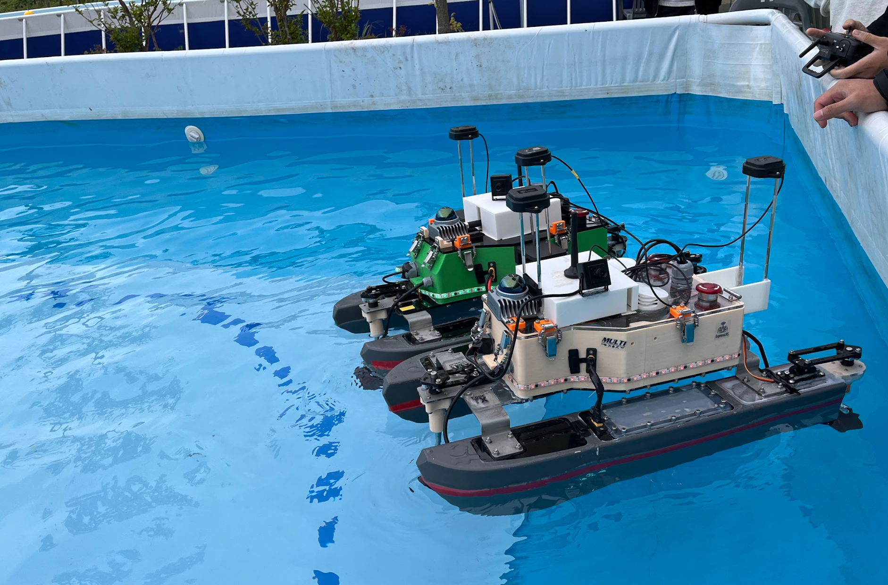

 
 

## KABOAT 2024 자율운항보트 경진대회 종합 1위(산업통상자원부 장관상)

    

      <h4><a href="https://www.lecturernews.com/news/articleView.html?idxno=164746">📄 기사 바로가기</a></h4>
      <h4><a href="https://youtu.be/IwlfTJ0ziOw">🎥 동영상 바로가기</a></h4>

## 🎖️ Awards
- (2024.10.06) KABOAT2024 종합 1위 첨단융합기술상 **[산업통상자원부 장관상]**
- (2022.10.07) 2022 창의공학 캡스톤디자인 졸업작품 경진대회 최우수상 **[충남대학교 총장상]**
- (2022.10.07) 2022 SW-IT Contest 비전공자 부문 대상 **[충남대학교 공과대학장상]**
- (2022.08.19) KABOAT2022 종합 3위 기술혁신상 **[경상남도 도지사상]**
- (2022.08.19) KABOAT2022 융합 설계상 **[(재)경남로봇랜드재단 원장상]**
  
## 💻 Skills

  
  

  
  
  
  
  

## 📖 Studying

  
  
  
  
  

   

<!-- -->
